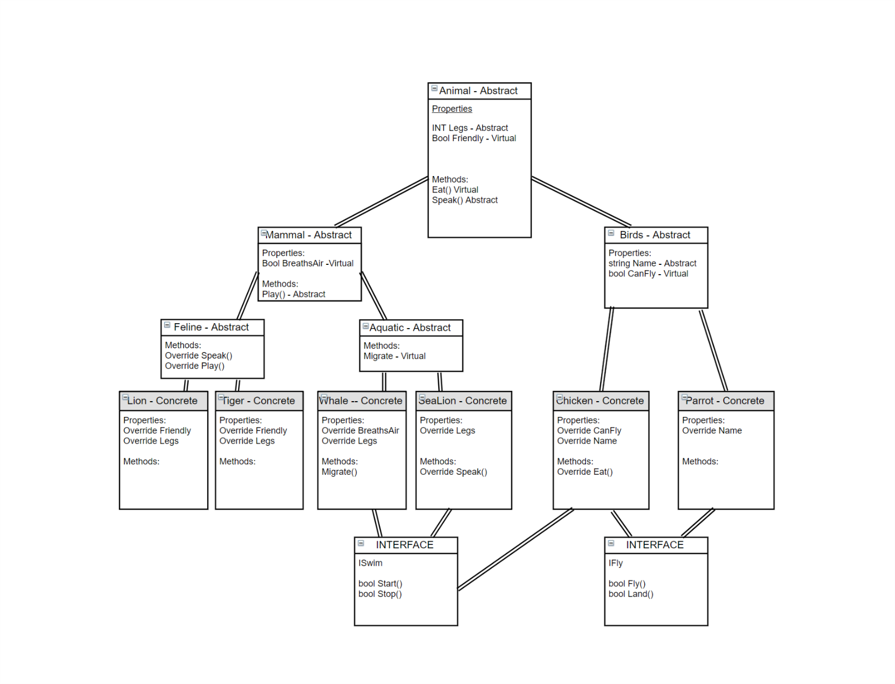

# Zoo
This app was made demonstrate and practice Interfaces, and the 4 principals of Object Oriented Programming: Abstraction, Inheritence, Encapsulation, and Polymorphism. 

### Diagram

### BreakDown of OOP Principles
Abstraction exists to pass a template of content to its derived classes.  
In this app I set the many abstract classes to pass methods and properties to its derived class.  

Encapsulation is when a group defintions like properties, or methods are grouped together and treated as a single object.  
In this app encapsulated content is found in concrete animals like a tiger.  

Inheritance states that a class can be built from another class, doing so, it inherits all of its members.  
In this app inheritance can be seen in tigers and lions as they inherit feline methods, and properties.  

Polymorphism is when each class implements the same methods and properties in varying ways.  
In this app you can see that the base abstract class animal has an eat method but it is virtual so that animals can eat different things  

### InterFaces
An interface is a set of defintions like properties, or methods that can be implemented by multiple classes. Unlike abstract classes they classes can inherit multiple interfaces. This app uses two interfaces used by four different concrete classes to allow those animals to fly or swim.
